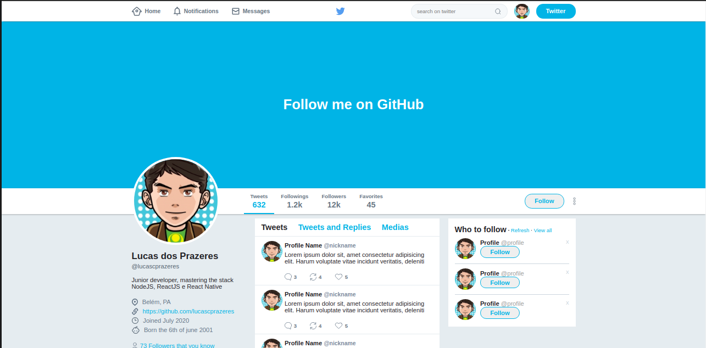

<h1 align=center>
  Twitter Layout 🐦
</h1>



<h2>Sobre 🔍</h2>

<p>
  Essa é uma representação em html e css puros, do layout do twitter desenvolvido durante o curso de flexbox ministrado por <a href="https://github.com/diego3g">Diego Fernandes.</a>
</p>

<h2>Como obter esse layout? 🤔💭</h2>

<p>
  Clique no botão de download, acima, ou execute o seguinte comando, no seu terminal com git:
</p>

```bash
  # isso vai clonar esse repositório na sua máquina

  git clone https://github.com/lucascprazeres/Twitter-layout
```

<hr>

<p align=center>Feito com 💜 por <a href="https://www.linkedin.com/in/lucas-prazeres/">Lucas dos Prazeres</a></p>